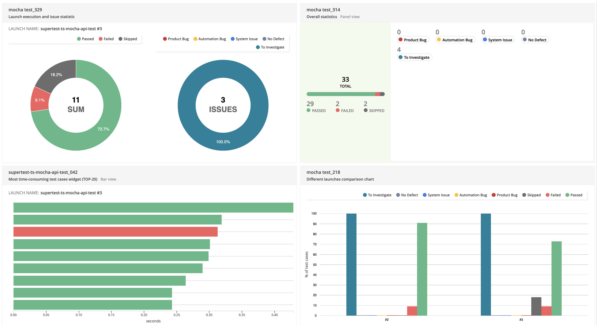

# API Test Automation framework
Boilerplate API test framework using Mocha, SuperTest and TypeScript.

#### Pre-requisite:
[](https://nodejs.org/en/download/)
[](https://code.visualstudio.com/download)

#### Getting Started:
Clone Repository

```bash
git https://github.com/sadabnepal/supertest-ts-mocha-api-test.git
cd supertest-ts-mocha-api-test
```

Install the dependencies
```bash
npm install
```

Setup user token
```bash
- Open the URL 'https://gorest.co.in/'
- Login or Sign
- Click on Login user drop down --> Access Token
- Create .env file and add actual token, refer .env.example file
```

Run tests
```bash
npm test
npm run test:rp [ to capture test results in report portal ]
```

Report Path:
```bash
path: <PROJECT_FOLDER>/report/index.html
```

Docker Run:
> Setup [docker](https://docs.docker.com/get-docker/) in your local machine to run test in dockerize environment
```bash
docker build -t node-api-image . [ you can given any name of your choice ]
docker run node-api-image:latest [ to run test inside docker ]
```

Run in Github Actions
> Currently test is setup to execute in github action on push event. You need to [create github secrete](https://docs.github.com/en/actions/security-guides/using-secrets-in-github-actions#creating-secrets-for-a-repository) for `GO_RES_USER_TOKEN` with value generated in `Setup user token` step.

<b> Github Permission to update report: </b> Go to Repository -> Settings -> Actions -> General <br>
Scroll to bottom of the page and look for 'Workflow permissions' section <br>
Check 'Read and write permission' and click on save


### Report Portal Integration
- Setup: run below two command to spin up report portal instance locally with docker (read more https://reportportal.io/installation)
    - curl -LO https://raw.githubusercontent.com/reportportal/reportportal/master/docker-compose.yml
    - docker-compose -p reportportal up -d --force-recreate
- Login: Open http://localhost:8080/ and login with time user `superadmin` and password `erebus`
- Generate API key:
    - Click on bottom left of logged in user --> click on `Profile`
    - Click on `API KEYS` --> `Generate API Key` --> copy the generated key
    - Create `.env` file in root project folder. Refer `.env.example` file
    - Paste your API key into `.env` file as `REPORT_PORTAL_KEY=<your api key>`
- Enter `REPORT_PORTAL_PROJECT=<project_assignment>` into `.env`. Value can be found on `PROJECT ASSIGNMENT` tab of user profile
- Other details are updated in `reportPortal.js` file



#### Features:
    - Supertest library
    - Mocha framework to organize tests
    - Mochawesome report integration with logs
    - Custom types for better code intellisense
    - Service as enum for better input control
    - Schema validation
    - Multi environment support 
    - Docker and Github integration
    - Enhanced import statements
    - Request and response report logger
    - Lint for better code quality
    - Husky for auto lint check before code commit
    - Manage secretes using dotenv library
    - Runtime dynamic test data generation using faker js library
    - AI powered Report Portal integration

#### Tech stacks:
[](https://github.com/visionmedia/supertest)
[](https://www.typescriptlang.org/)
[](https://mochajs.org/)
[](https://www.chaijs.com/)
[](https://github.com/features/actions)
[](https://www.docker.com/)
[]([https://www.docker.com/](https://typescript-eslint.io/))
[]([https://www.docker.com/](https://typicode.github.io/husky/))

#### Folder Structure:
```bash
├───.github
├───.husky
├───.vscode
├───src
|     ├───data
|     ├───env
|     ├───helper
|     ├───schema
|     ├───services
|     ├───static
|     ├───test
|     └───types
├───.env.example
├───.eslintrc.js
├───.gitignore
├───.mocharc.js
├───Dockerfile
├───package-lock.json
├───package.json
├───README.md
└───tsconfig.json
```

#### Sample Report

